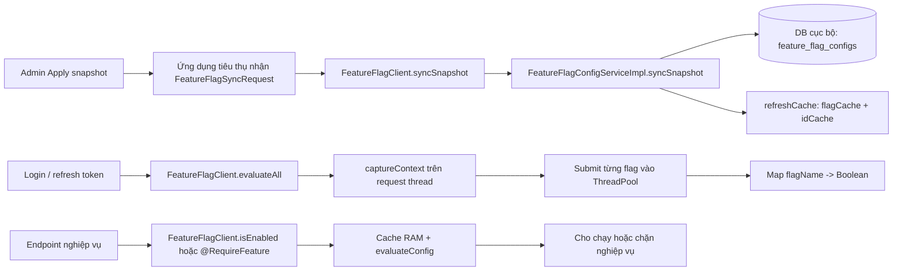

# feature-flag-lib

> Thư viện Spring Boot dùng chung để nhận snapshot feature flag, lưu cấu hình vào DB cục bộ, cache trong RAM và đánh giá flag theo request.

## Mục lục

1. [Luồng tổng quan](#1-luồng-tổng-quan)
2. [Yêu cầu và cài đặt](#2-yêu-cầu-và-cài-đặt)
3. [Cấu hình ứng dụng tiêu thụ](#3-cấu-hình-ứng-dụng-tiêu-thụ)
4. [Sử dụng FeatureFlagClient](#4-sử-dụng-featureflagclient)
5. [Dùng @RequireFeature](#5-dùng-requirefeature)
6. [Đồng bộ snapshot](#6-đồng-bộ-snapshot)
7. [Cách đánh giá flag](#7-cách-đánh-giá-flag)
8. [Thread pool của evaluateAll()](#8-thread-pool-của-evaluateall)
9. [Cấu trúc dữ liệu và lưu ý vận hành](#9-cấu-trúc-dữ-liệu-và-lưu-ý-vận-hành)

## 1. Luồng tổng quan

Thư viện không gọi `feature-flag-service` mỗi lần kiểm tra flag. Service quản lý/admin gửi snapshot tới ứng dụng tiêu thụ; thư viện lưu snapshot trong DB của ứng dụng đó và đưa cấu hình vào cache RAM.



Khi ứng dụng khởi động, `@PostConstruct initCache()` gọi `refreshCache()` để nạp DB local vào RAM. Sau khi ghi snapshot, `syncSnapshot()` cũng gọi `refreshCache()`. Hàm refresh tự bắt và log lỗi; nếu refresh gặp lỗi đọc DB hoặc parse cấu hình thì cache có thể chưa phản ánh snapshot mới, nên cần kiểm tra log đồng bộ.

## 2. Yêu cầu và cài đặt

- Java 21+
- Spring Boot 3.x (thư viện hiện khai báo Spring Boot 3.4.0)
- Ứng dụng tiêu thụ cần cấu hình datasource/JPA và một cơ sở dữ liệu được Hibernate hỗ trợ. Cột `strategies` được ánh xạ dạng JSON; ví dụ triển khai hiện dùng MySQL.

Tọa độ Maven trong `pom.xml`:

```xml
<dependency>
    <groupId>com.example</groupId>
    <artifactId>feature-flag-lib</artifactId>
    <version>1.0.0</version>
</dependency>
```

Build và cài vào Maven local:

```powershell
.\mvnw.cmd clean install
```

Hoặc nếu máy đã cài Maven:

```bash
mvn clean install
```

Nếu ứng dụng build trong Docker và không dùng chung Maven local, đưa JAR vào build context của ứng dụng rồi cài JAR vào Maven local trong Dockerfile. Sau khi cập nhật thư viện, cần thay JAR mà ứng dụng tiêu thụ đang dùng và build lại ứng dụng/image.

## 3. Cấu hình ứng dụng tiêu thụ

Auto-configuration được đăng ký tại `META-INF/spring/org.springframework.boot.autoconfigure.AutoConfiguration.imports`. Thông thường chỉ cần thêm dependency. `@EnableFeatureFlag` có thể dùng để import cấu hình một cách tường minh nếu ứng dụng cần.

```java
@SpringBootApplication
@EnableFeatureFlag
public class TrackingOrderApplication {
    public static void main(String[] args) {
        SpringApplication.run(TrackingOrderApplication.class, args);
    }
}
```

Ứng dụng phải cấu hình datasource kết nối tới **DB cục bộ của chính ứng dụng tiêu thụ**. Thư viện đăng ký entity/repository trong package của nó và dùng schema `feature_flag_configs`.

Ví dụ `application.yml`:

```yaml
spring:
  datasource:
    url: jdbc:mysql://localhost:3306/tracking_order?useSSL=false&serverTimezone=UTC&allowPublicKeyRetrieval=true
    username: root
    password: change-me
  jpa:
    hibernate:
      ddl-auto: update

feature-flag:
  executor:
    core-pool-size: 4
    max-pool-size: 8
    queue-capacity: 16
    max-pending-tasks: 24
    thread-name-prefix: ff-eval-
    wait-for-tasks-to-complete-on-shutdown: true
    await-termination-seconds: 10
```

`ddl-auto: update` chỉ là ví dụ cho môi trường phát triển. Môi trường triển khai có thể dùng migration/schema management riêng.

## 4. Sử dụng FeatureFlagClient

`FeatureFlagClient` là facade công khai để code ứng dụng kiểm tra flag.

### Kiểm tra một flag

```java
@Service
@RequiredArgsConstructor
public class OrderService {
    private final FeatureFlagClient featureFlagClient;

    public void calculatePrice(Order order) {
        if (featureFlagClient.isEnabled("PRICE_INCREASE")) {
            applyNewPricing(order);
        } else {
            applyCurrentPricing(order);
        }
    }
}
```

`isEnabled(name)` trả `false` nếu flag không tồn tại hoặc facade gặp `RuntimeException`.

### Lấy toàn bộ trạng thái flag

Thường dùng lúc login/refresh token để đưa map vào response:

```java
Map<String, Boolean> features = featureFlagClient.evaluateAll();
```

`evaluateAll()` đánh giá theo context của request hiện tại và trả `Map<String, Boolean>`. Nếu có lỗi runtime thoát ra facade, facade log và trả map rỗng.

### Đồng bộ snapshot

```java
int savedCount = featureFlagClient.syncSnapshot(snapshotRequest);
```

Thư viện cung cấp hàm nhận DTO và lưu snapshot; endpoint HTTP, bảo vệ token và việc parse file snapshot thuộc ứng dụng tiêu thụ/control-plane tích hợp với thư viện.

## 5. Dùng @RequireFeature

Gắn annotation lên method cần bảo vệ. Aspect gọi `FeatureFlagClient.isEnabled()` trước khi chạy method.

```java
@RestController
@RequestMapping("/api/orders")
public class OrderController {
    @PostMapping("/buy-now")
    @RequireFeature(features = "BUY_NOW", message = "Tính năng Mua ngay đang bảo trì")
    public OrderResponse buyNow(@RequestBody OrderRequest request) {
        return orderService.buyNow(request);
    }

    @GetMapping("/{id}/invoice")
    @RequireFeature(features = {"ORDER_DETAIL", "EXPORT_INVOICE"})
    public InvoiceResponse getInvoice(@PathVariable String id) {
        return orderService.getInvoice(id);
    }
}
```

Nếu danh sách có nhiều flag, **tất cả phải bật** thì method mới chạy. Khi có flag tắt, aspect ném `FeatureFlagDisabledException`; exception mang `HttpStatus.BAD_REQUEST` và message lấy từ annotation. Ứng dụng tiêu thụ cần exception handler phù hợp để ánh xạ exception thành HTTP response theo ý muốn.

## 6. Đồng bộ snapshot

`FeatureFlagSyncRequest` có `version`, `exportedAt` và `features`. Mỗi `FeatureFlagSyncItem` có `id`, `flagName`, `enabled`, `parentId`, `strategyLogic`, `version` và `strategies`.

Luồng `syncSnapshot()`:

1. Request null hoặc `features == null` thì bỏ qua và trả `0`. Một list rỗng không null là snapshot rỗng và sẽ loại các cấu hình hiện tại.
2. Lấy version từ request; nếu trống thì tạo version dự phòng theo timestamp.
3. Đọc cấu hình DB hiện tại và lập map theo tên flag chuẩn hóa.
4. Với mỗi item hợp lệ, cập nhật entity hiện có hoặc tạo entity mới. Item null/không có tên flag được bỏ qua.
5. Xóa config cũ không còn xuất hiện trong snapshot.
6. `saveAll()` rồi `flush()` DB.
7. `refreshCache()` nạp lại map RAM; hàm trả số entity đã đưa vào danh sách lưu.

`syncSnapshot()` chạy trong transaction. Nếu thao tác lưu ném lỗi, transaction được rollback; lỗi được truyền cho caller (không bị facade `syncSnapshot()` đổi thành kết quả mặc định).

## 7. Cách đánh giá flag

### Một config

`evaluateConfig()` kiểm tra theo thứ tự:

1. `enabled` phải là `true`, nếu không trả `false`.
2. Nếu có `parentId`, parent phải được tìm thấy trong `idCache`, đang bật và không tạo chu trình cha-con.
3. Nếu không có strategy, config bật cho mọi context.
4. Nếu có strategy, `AND` yêu cầu tất cả strategy đúng; `OR` hoặc logic mặc định yêu cầu ít nhất một strategy đúng.
5. Strategy ID được tra trong `strategyMap`. ID không được hỗ trợ trả `false`.

Lỗi khi đánh giá config được bắt và config đó trả `false`. Nếu nhiều config có cùng flag name, `flagCache` giữ chúng thành list và `anyMatch` khiến một config đúng là đủ để tên flag trả `true`. Thiết kế nghiệp vụ dự kiến tên flag là duy nhất; quan hệ cha như `BUY` → `BUY_NOW` dùng `parentId`, không phải tên bị trùng.

### Strategy có sẵn

| Strategy | ID hỗ trợ | Params được đọc |
|---|---|---|
| Username whitelist | `username`, `users_by_name` | `users` hoặc `value`; tên phân tách bằng dấu phẩy/khoảng trắng |
| Role/authority | `user-role`, `user_role`, `role` | `roles`, `role` hoặc `value`; hỗ trợ authority có prefix `ROLE_` |
| Client IP whitelist | `remote-client-ip`, `ip_whitelist`, `ip` | `ips` hoặc `value` |
| Release date | `release-date`, `release_date` | `date`, `releaseDate` hoặc `value`; hỗ trợ ngày hoặc datetime |
| Gradual rollout | `gradual-rollout`, `gradual_rollout`, `gradual_rollout_user_id`, `rollout` | `percentage` hoặc `value`; hash username, fallback sang IP |

Strategy JSON mẫu:

```json
[
  {
    "strategyId": "user_role",
    "params": { "roles": "ROLE_BUYER" }
  },
  {
    "strategyId": "users_by_name",
    "params": { "users": "alice,bob" }
  }
]
```

## 8. Thread pool của evaluateAll()

Mỗi task đánh giá **một tên flag**. Task hoàn tất thì worker quay lại pool; không giữ worker để chạy cả batch 100 flag. `CompletionService` lấy task nào hoàn tất trước, request thread ghi kết quả vào map rồi submit flag tiếp theo.

```text
5.000 tên flag, max-pending-tasks = 24
submit tối đa 24 task → nhận task hoàn tất → ghi kết quả → submit flag tiếp theo
                                               lặp đến khi map đủ 5.000 kết quả
```

`max-pending-tasks` giới hạn task đang chạy/chờ được theo dõi bởi **một lần gọi** `evaluateAll()`. Nó không phải giới hạn toàn hệ thống; nhiều request login đồng thời có thể cùng submit task vào executor. Queue của executor và `CallerRuns` handler tạo giới hạn/backpressure dùng chung. Nếu pool và queue đầy, thread submit tự chạy task bị từ chối thay vì loại bỏ task.

Request vẫn phải đợi toàn bộ flag xong để trả map đầy đủ. Trong lúc đó `CompletionService.take()` làm request thread chờ kết quả; worker không chờ các worker khác. Luồng hiện tại không dùng batch và không gọi `CompletableFuture.join()`.

| Property | Default | Ý nghĩa |
|---|---:|---|
| `core-pool-size` | `4` | Số worker lõi |
| `max-pool-size` | `8` | Số worker tối đa; pool thường chỉ tăng quá core khi queue đầy |
| `queue-capacity` | `16` | Số task có thể chờ trong queue |
| `max-pending-tasks` | `24` | Số task một lần `evaluateAll()` submit/track đồng thời |
| `thread-name-prefix` | `ff-eval-` | Prefix tên worker |
| `wait-for-tasks-to-complete-on-shutdown` | `true` | Chờ task khi ứng dụng shutdown |
| `await-termination-seconds` | `10` | Thời gian chờ tối đa khi shutdown |

Các giá trị trên là mặc định/điểm bắt đầu, không phải cấu hình tối ưu cho mọi máy. Hãy benchmark p95/p99 login, CPU, heap, số request đồng thời, active threads và queue trước khi tuning. Nếu ứng dụng khai báo bean riêng tên `featureFlagExecutor`, bean đó thay thế executor mặc định và ứng dụng chịu trách nhiệm cấu hình hành vi từ chối task.

## 9. Cấu trúc dữ liệu và lưu ý vận hành

### Cache RAM

- `flagCache`: tên flag chuẩn hóa → danh sách `FeatureFlagConfig`.
- `idCache`: entity ID → `FeatureFlagConfig`, dùng tra parent.
- `parsedStrategies`: danh sách strategy đã parse, là field `@Transient`, chỉ ở RAM.
- Cache chứa **cấu hình**, không phải map kết quả đã cache theo user. Mỗi lần login/refresh gọi `evaluateAll()` sẽ đánh giá lại theo context hiện tại.

Cache thuộc từng process. Nếu có nhiều instance, mỗi instance cần dùng dữ liệu DB đồng bộ và phải refresh cache tương ứng. Chỉ thấy flag trong DB của control-plane không chứng minh flag đã được Apply vào DB của service tiêu thụ.

### Schema

Entity ánh xạ bảng `feature_flag_configs` với các trường chính: `id`, `flag_name`, `enabled`, `parent_id`, `strategies` (JSON), `strategy_logic`, `applied_version` và audit fields từ `BaseEntity`. Có index trên `flag_name` và `parent_id`. Dữ liệu schema được Hibernate tạo/cập nhật theo cấu hình ứng dụng; thư viện không cung cấp migration tool riêng.

### Debug nhanh

1. Sau startup, xem log `Đã đồng bộ ... cờ tính năng vào In-Memory Cache`.
2. Sau Apply, kiểm tra response của luồng sync và bảng `feature_flag_configs` trong DB của ứng dụng tiêu thụ.
3. Kiểm tra map `features` trong response login/refresh có số key mong đợi.
4. Nếu feature guard chặn method, kiểm tra tên flag, `enabled`, parent ID, strategy ID/params và context username/role/IP.

## Tham khảo thêm

- [FEATURE_FLAG_ROADMAP.md](FEATURE_FLAG_ROADMAP.md): call graph và các hàm chính.
- [FEATURE_FLAG_SCALING.md](FEATURE_FLAG_SCALING.md): benchmark, giới hạn tải và triển khai vào `tracking-order`.
- [FEATURE_FLAG_SERVICE_IMPL_GUIDE.html](FEATURE_FLAG_SERVICE_IMPL_GUIDE.html): hướng dẫn đọc `FeatureFlagConfigServiceImpl` theo workflow và code.
- [FEATURE_FLAG_EVALUATE_FLOW.html](FEATURE_FLAG_EVALUATE_FLOW.html): sơ đồ trực quan luồng evaluate.
